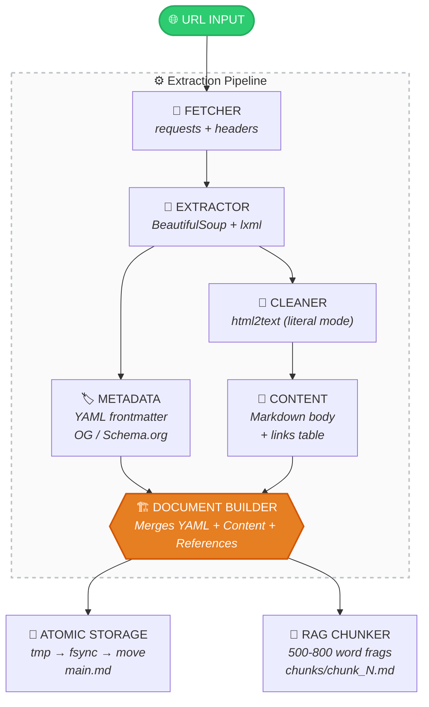
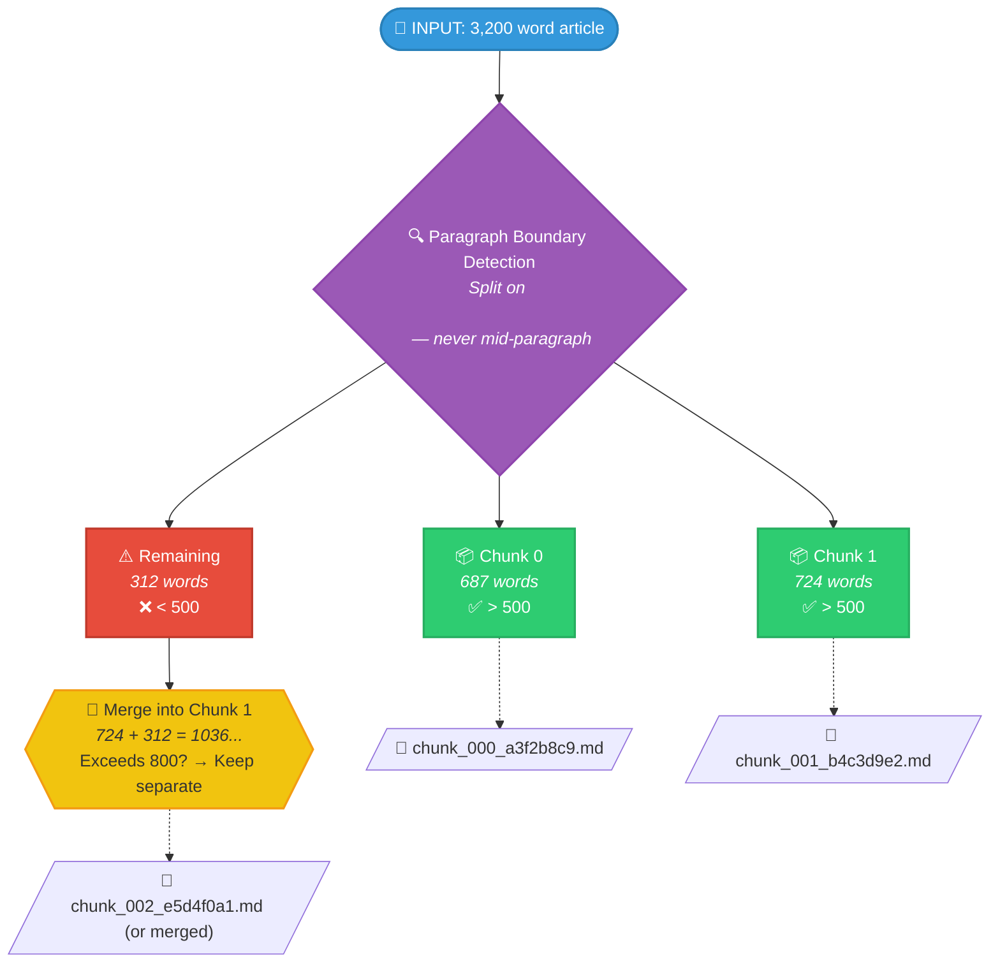

<div align="center">

&nbsp;
&nbsp;
&nbsp;


<br><br>


# URL Extractor MD

**Zero-loss web content extraction engine for RAG pipelines.**
Fetch any URL, extract its content with surgical precision, and produce
structured Markdown files optimized for vector search ingestion.

<br>

<a href="#-quick-start">Quick Start</a> ·
<a href="#-architecture">Architecture</a> ·
<a href="#-features">Features</a> ·
<a href="#-gui">GUI</a> ·
<a href="#-api-reference">API</a> ·
<a href="#-installation">Install</a>

<br>


</div>

---

## Table of Contents

- [Why This Exists](#-why-this-exists)
- [Features](#-features)
- [Quick Start](#-quick-start)
- [Architecture](#-architecture)
- [Output Schema](#-output-schema)
- [GUI Application](#-gui-application)
- [API Reference](#-api-reference)
- [RAG Chunking Strategy](#-rag-chunking-strategy)
- [Configuration](#-configuration)
- [Installation](#-installation)
- [CLI Usage](#-cli-usage)
- [Project Structure](#-project-structure)
- [Contributing](#-contributing)
- [License](#-license)

---

## Why This Exists

> Most web scrapers lose content. They strip formatting, mangle unicode,
> eat special characters, and produce output that **destroys vector indexes**.

URL Extractor MD was built for a single purpose: **ingest web content into RAG systems with zero data loss.**

<table>
<tr>
<td width="50%" valign="top">

### ❌ The Problem

- 🗑️ **Generic scrapers** strip `<article>` content alongside navbars, cookie banners, and ads
- 🔠 **Encoding errors** corrupt accented characters (`á é ñ ü`) breaking tokenizer indexes
- ⚠️ **No atomic writes** — interrupted saves produce corrupted, half-written files
- 🧩 **Output format** is not optimized for vector DB chunking

</td>
<td width="50%" valign="top">

### ✅ The Solution

- 🎯 **Semantic content isolation** via advanced CSS selector priority tree
- 🛡️ **Forced UTF-8 encoding** guarantees character preservation at every stage
- 🔒 **Atomic write pattern:** `tmp → fsync → os.replace()` ensures safe disk writes
- 🗂️ **RAG-optimized chunks** of 500-800 words with complete YAML provenance

</td>
</tr>
</table>

---

## Features

<table>
<tr>
<td width="33%" valign="top" align="center">

**Zero-Loss Extraction**
<br><br>
Literal Markdown conversion via `html2text` in strict mode. No whitespace manipulation, no paragraph beautification, no content alteration.

</td>
<td width="33%" valign="top" align="center">

**Atomic Storage**
<br><br>
Every file write is atomic. Write to `.tmp`, `fsync`, then `os.replace()`. No partial files. No corruption. Ever.

</td>
<td width="33%" valign="top" align="center">

**RAG Chunking**
<br><br>
Automatic 500-800 word fragments respecting paragraph boundaries. Each chunk carries YAML provenance metadata.

</td>
</tr>
<tr>
<td width="33%" valign="top" align="center">

**Deep Metadata**
<br><br>
Extracts author, site name, OG tags, schema.org, published date, language, and content type with smart fallbacks.

</td>
<td width="33%" valign="top" align="center">

**Noise Isolation**
<br><br>
17 CSS noise selectors + 10 tag strippers remove ads, cookie banners, sidebars, navbars, and comment sections.

</td>
<td width="33%" valign="top" align="center">

**Premium GUI**
<br><br>
PySide6/Qt6 desktop application with real-time log, progress tracking, dry-run preview, and Material Design aesthetics.

</td>
</tr>
</table>

<div align="center">

| | Feature | Status |
|:---:|---|:---:|
| ✅ | HTML → Markdown (literal mode) | Complete |
| ✅ | YAML frontmatter (RAG schema v1.0) | Complete |
| ✅ | Atomic file storage | Complete |
| ✅ | RAG chunking (500-800 words) | Complete |
| ✅ | Metadata extraction (OG, Schema.org) | Complete |
| ✅ | Noise removal (ads, banners, navs) | Complete |
| ✅ | Content selector priority tree | Complete |
| ✅ | PySide6 GUI with live logging | Complete |
| ✅ | CLI with preview mode | Complete |
| ✅ | UTF-8 forced encoding | Complete |
| 🔲 | JavaScript rendering (Playwright) | Planned |
| 🔲 | Batch URL processing | Planned |
| 🔲 | PDF/EPUB export | Planned |

</div>

---

## Quick Start

```bash
# Install
pip install -r requirements.txt

# Preview (dry run — no files saved)
python rag_extract.py https://example.com/article --preview

# Extract and save
python rag_extract.py https://example.com/article -o ./output

# With custom filename
python rag_extract.py https://example.com/article -o ./output -n my-article

# Launch GUI
python download_engine_ui.py
```

**One-line in your code:**

```python
from rag_extract import quick_extract

result = quick_extract(
    url="https://example.com/article",
    save_dir="./output",
    filename="my-article"
)

print(result.success)          # True
print(result.file_path)        # ./output/my-article.md
print(result.checksum_sha256)  # a3f2b8c9d1e4...
```

---

## Architecture

<div align="center">



</div>

### Extraction Priority Tree

The content extractor uses a **priority-ordered CSS selector tree** to find the main content area, avoiding noise:

```
1. <article>              ← Highest confidence
2. [role='main']          ← ARIA landmark
3. <main>                 ← HTML5 semantic
4. .post-content          ← WordPress/CMS
5. .article-content       ← News sites
6. .entry-content         ← Blog engines
7. .content-body          ← Custom CMS
8. .page-content          ← Static sites
9. .story-body            ← News outlets
10. #content / #main-content
11. .markdown-body        ← GitHub/GitLab
12. <body>                ← Last resort
```

---

## Output Schema

Every `.md` file follows this RAG-optimized schema:

```yaml
---
metadata_version: 1.0
timestamp: "2025-06-05T19:48:52Z"
source_url: "https://example.com/article"
site_name: "Example"
author: "Jane Doe"
content_type: "articulo"
language: "es"
published_date: "2025-06-01T10:00:00Z"
description: "A brief description of the article"
keywords: "keyword1, keyword2, keyword3"
word_count: 2450
paragraph_count: 18
extraction_status: "success"
---

# Title of the Source

## Resumen del Objeto
Brief objective description extracted from the source.

## Contenido Extraído
[Literal text — zero alterations, preserving original line breaks
and block structure exactly as found on the page]

## Enlaces de Referencia
1. https://example.com/link-1
2. https://example.com/link-2
3. https://example.com/link-3
```

### Chunk Schema

```yaml
---
metadata_version: 1.0
chunk_id: "a3f2b8c9d1e4"
chunk_index: 0
total_chunks: 5
source_url: "https://example.com/article"
source_title: "Article Title"
word_count: 672
---

# Article Title — Fragmento 1/5

## Contenido
[500-800 words of literal content from this segment]
```

---

## GUI Application

<table>
<tr>
<td width="50%">

### Design Philosophy

- **Material You** meets **Apple HIG**
- Warm paper-white surface (`#F4F1EC`)
- Google Blue accent (`#1A73E8`)
- Zero pure-black — all surfaces are soft
- Every shadow is intentional
- Typography: SF Pro / Segoe UI hierarchy

</td>
<td width="50%">

### Capabilities

- Paste URL → Auto-detect filename
- Folder picker with KDE native dialog
- Real-time progress bar with speed
- Color-coded activity log (info/success/warning/error)
- Live preview before saving
- Download + Extract in unified interface

</td>
</tr>
</table>

```text
 ┌─────────────────────────────────────────────┐
 │  ✨ Download Engine                         │
 │  Paste a URL, choose a destination…         │
 │                                             │
 │  ┌─────────────────────────────────────────┐│
 │  │  URL          [🔗] [https://example...] ││
 │  │  FILENAME     [📄] [article-name      ] ││
 │  │  SAVE TO      [~/Downloads] [📁 btn]    ││
 │  │                                         ││
 │  │  ─────────────────────────────────────  ││
 │  │  PROGRESS       73%      12.4 MB/s      ││
 │  │  ██████████████████░░░░░░░░░░░░░░░░░░   ││
 │  │  Downloading…                           ││
 │  │                                         ││
 │  │  ─────────────────────────────────────  ││
 │  │  ACTIVITY LOG              [🧹 Clear]   ││
 │  │  ┌─────────────────────────────────────┐││
 │  │  │ ℹ️ 12:04:01 Conectando a: https://… │││
 │  │  │ ✅ 12:04:02 TLS handshake complete  │││
 │  │  │ 🔄 12:04:03 Progress: 45% — 32.1 MB │││
 │  │  └─────────────────────────────────────┘││
 │  └─────────────────────────────────────────┘│
 │                                             │
 │  [❌ Cancel]                     [▶️ Start] │
 └─────────────────────────────────────────────┘
```

### Integration

```python
from PySide6.QtWidgets import QApplication
from download_engine_ui import DownloadEngineUI
from rag_extract import RAGPipeline, PipelineEvents

# Wire the extraction pipeline into the Qt UI
events = PipelineEvents()
events.on_log.connect(lambda lvl, msg: window._log(lvl, msg))
events.on_progress.connect(lambda s, t, m: window.progress_bar.setValue(int(s/t*100)))

pipeline = RAGPipeline(events)
```

---

## API Reference

### `RAGPipeline`

```python
pipeline = RAGPipeline(events: PipelineEvents = None)
```

#### `pipeline.preview(url, save_directory, custom_filename=None) → PreviewResult`

Dry-run extraction. Returns metadata and preview without saving.

```python
preview = pipeline.preview(
    url="https://example.com/article",
    save_directory="./output"
)

print(preview.metadata.title)       # "Article Title"
print(preview.metadata.author)      # "Jane Doe"
print(preview.word_count)           # 2450
print(preview.estimated_chunks)     # 4
print(preview.proposed_filename)    # "article.md"
print(preview.warnings)             # ["Autor no detectado..."]
```

#### `pipeline.execute(url, save_directory, custom_filename=None, generate_chunks=True) → Tuple[StorageResult, List[StorageResult], ExtractionResult]`

Full pipeline execution.

```python
main, chunks, extraction = pipeline.execute(
    url="https://example.com/article",
    save_directory="./output",
    custom_filename="my-doc",
    generate_chunks=True
)

# Main document
print(main.success)             # True
print(main.file_path)           # ./output/my-doc.md
print(main.checksum_sha256)     # a3f2b8c9...

# RAG chunks
for chunk_result in chunks:
    print(chunk_result.file_path)   # ./output/my-doc_chunks/chunk_000_x.md
```

### `ContentExtractor`

```python
extractor = ContentExtractor(events: PipelineEvents = None)

# Full extraction
result = extractor.extract("https://example.com/article")

# Result properties
result.metadata         # PageMetadata object
result.clean_markdown   # Literal markdown string
result.word_count       # int
result.links_found      # List[str]
result.images_found     # List[str]
result.status           # ExtractionStatus enum
result.is_valid         # bool
```

### `AtomicStorageEngine`

```python
storage = AtomicStorageEngine(events: PipelineEvents = None)

result = storage.store_document(
    content="...",
    directory="./output",
    filename="my-doc",
    extension=".md"   # default
)

print(result.success)        # True
print(result.file_path)      # ./output/my-doc.md
print(result.checksum_sha256)
```

### `RAGChunker`

```python
chunker = RAGChunker(
    min_words=500,   # default
    max_words=800    # default
)

chunks = chunker.chunk(extraction_result)

for chunk in chunks:
    print(f"Chunk {chunk.index}: {chunk.word_count} words")
    print(f"  ID: {chunk.chunk_id}")
    print(f"  Content: {chunk.content[:80]}...")
```

### `SlugGenerator`

```python
from rag_extract import SlugGenerator

SlugGenerator.generate("Cómo cocinar paella — Guía 2025!")
# → "como-cocinar-paella-guia-2025"

SlugGenerator.from_url("https://blog.example.com/2025/ai-tools")
# → "2025-ai-tools"
```

### `PipelineEvents` (Signal Bus)

```python
events = PipelineEvents()

events.on_log.connect(lambda level, msg: print(f"[{level}] {msg}"))
events.on_progress.connect(lambda step, total, msg: ...)
events.on_error.connect(lambda error_type, msg: ...)
events.on_fetch_start.connect(lambda url: ...)
events.on_fetch_complete.connect(lambda url, size: ...)
events.on_store_complete.connect(lambda path, size: ...)
```

---

## RAG Chunking Strategy

<div align="center">



</div>

**Why 500-800 words?**

| Chunk Size | Vector DB Performance | Context Quality |
|:---:|:---:|:---:|
| < 200 words | High recall, low precision | Too fragmented |
| **500-800 words** | **Balanced** | **Optimal semantic density** |
| > 1500 words | Low recall | Too broad for embeddings |

---

## Configuration

### Environment Variables

```bash
# Optional — override defaults
RAG_CHUNK_MIN=500          # Minimum words per chunk
RAG_CHUNK_MAX=800          # Maximum words per chunk
RAG_TIMEOUT=30             # HTTP request timeout (seconds)
RAG_USER_AGENT="Custom/1.0"  # Custom user agent string
```

### Programmatic Configuration

```python
from rag_extract import RAGPipeline, RAGChunker, PipelineEvents

# Custom chunker
pipeline = RAGPipeline()
pipeline.chunker = RAGChunker(min_words=300, max_words=600)

# Custom content selectors
from rag_extract import CONTENT_SELECTORS, NOISE_SELECTORS

CONTENT_SELECTORS.insert(0, ".my-custom-selector")
NOISE_SELECTORS.append("[class*='my-noise']")
```

---

## Installation

### Prerequisites

```
Python 3.10+
```

### Install from source

```bash
git clone https://github.com/j3susangar1ca/URL-Extractor-MD.git
cd URL-Extractor-MD
pip install -r requirements.txt
```

### Dependencies

```
beautifulsoup4    # HTML parsing
lxml              # Fast HTML/XML parser
html2text         # HTML → Markdown (literal mode)
requests          # HTTP client
PyYAML            # YAML generation
PySide6           # Qt6 GUI framework (optional)
```

### Verify installation

```bash
python rag_extract.py --check-deps
```

```
  ✓ All dependencies installed
```

---

## CLI Usage

```
usage: rag_extract.py [-h] [-o OUTPUT] [-n NAME] [--no-chunks]
                      [--preview] [--check-deps] [url]

RAG Content Extraction Engine

positional arguments:
  url                   URL to extract

optional arguments:
  -o, --output OUTPUT   Output directory (default: ~/Downloads)
  -n, --name NAME       Custom filename (without extension)
  --no-chunks           Skip RAG chunk generation
  --preview             Preview extraction without saving
  --check-deps          Check required dependencies
```

### Examples

```bash
# Preview metadata and content before saving
python rag_extract.py https://en.wikipedia.org/wiki/Python_(programming_language) --preview

# Extract with custom name
python rag_extract.py https://docs.python.org/3/tutorial/ -o ./docs -n python-tutorial

# Extract without chunking
python rag_extract.py https://blog.example.com/post --no-chunks -o ./articles
```

---

## Project Structure

```
URL-Extractor-MD/
│
├── rag_extract.py           # Core extraction engine
│   ├── ContentExtractor     #   Fetch + parse + clean
│   ├── RAGChunker           #   500-800 word fragmentation
│   ├── MarkdownBuilder      #   YAML + Markdown assembly
│   ├── AtomicStorageEngine  #   tmp → fsync → replace
│   ├── SlugGenerator        #   Filename generation
│   └── PipelineEvents       #   Signal bus for Qt integration
│
├── download_engine_ui.py    # PySide6/Qt6 GUI application
│   ├── DownloadEngineUI     #   Main window
│   ├── DownloadWorker       #   QThread worker
│   └── Theme                #   Design tokens
│
├── requirements.txt
├── README.md
├── LICENSE
└── assets/
    ├── banner.png
    └── demo.gif
```

---

## Contributing

Contributions are welcome. Please follow these guidelines:

1. **Fork** the repository
2. **Create** a feature branch (`git checkout -b feat/amazing-feature`)
3. **Commit** with conventional commits (`feat:`, `fix:`, `docs:`)
4. **Test** your changes
5. **Push** and open a **Pull Request**

### Development Setup

```bash
git clone https://github.com/j3susangar1ca/URL-Extractor-MD.git
cd URL-Extractor-MD
python -m venv .venv
source .venv/bin/activate   # or .venv\Scripts\activate on Windows
pip install -r requirements.txt
```

---

## License

Distributed under the **MIT License**. See `LICENSE` for more information.

---

<div align="center">

**Built with precision for the RAG ecosystem.**

<br>


<br><br>

<a href="https://github.com/j3susangar1ca/URL-Extractor-MD/stargazers">⭐ Star</a> ·
<a href="https://github.com/j3susangar1ca/URL-Extractor-MD/issues">🐛 Issues</a> ·
<a href="https://github.com/j3susangar1ca/URL-Extractor-MD/pulls">🔀 PRs</a>

</div>
```